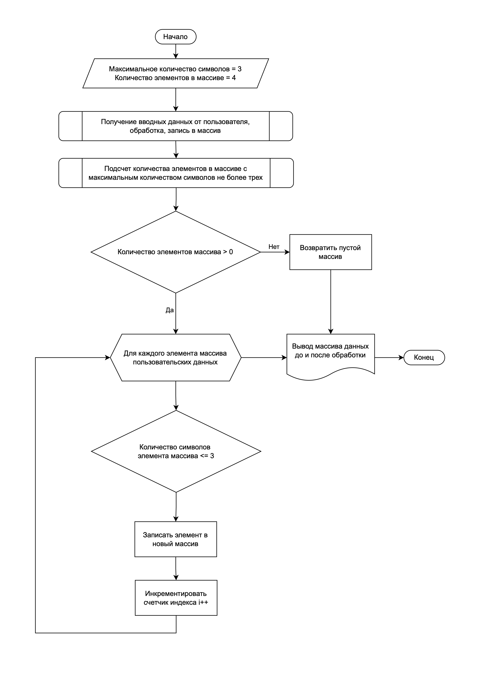

# Итоговая проверочная работа

> Данная работа необходима для проверки ваших знаний и навыков по итогу прохождения первого блока обучения на программе разработчик. Мы должны убедиться что базовое знакомство с IT прошло успешно.

Задача алгоритмически не самая сложная, однако для полноценного выполнения проверочной работы необходимо:

1. Создать репозиторий в GitHub
2. Нарисовать блок-схему алгоритма (можно обойтись блок-схемой сновной содержательной части, если вы выделяете ее в отдельный метод)
3. Снабдить репозиторий оформленным текстовым описанием решения (файл README.md)
4. Написать программу, решающую поставленную задачу
5. Использовать контроль версий в работе над этим небольшим проектом (не должно быть так что все залито дним коммитом, как минимум этапы 2-4 должны быть расположены в разных коммитах)

## Задача:

Написать программу, которая из имеющегося массива строк формирует массив из строк, длина которых меньше либо равна 3 символа. Первоначальный массив можно ввести с клавиатуры, либо задать на старте выполнения алгоритма. При решении не рекомендуется пользоваться коллекциями, лучше обойтись исключительно массивами.

## Примеры:

`["hello", "2", "world", ":-)"] -> ["2", ":-)"]`

`["1234", "1567", "-2", "computer science"] -> ["-2"]`

`["Russia", "Denmark", "Kazan"] -> []`

## Решение задачи

Для решения данной задачи необходимо выполнить следующие действия:

1. Получить вводные данные от пользователя через консоль
2. Обработать эти данные и записать их в массив
3. Подсчитать количество элементов в данном массиве у которых колличество символов менее или равно трём (это необходимо для определения размера нового массива)
4. Выбрать только эти элементы и записать их в новый массив
5. Вывести результат выполнения в консоль (в формате как указано в *Примере* выше)

## Блок-схема

[Блок-схема в формате PDF](logic.pdf) | [Блок-схема в исходном формате](logic.drawio)